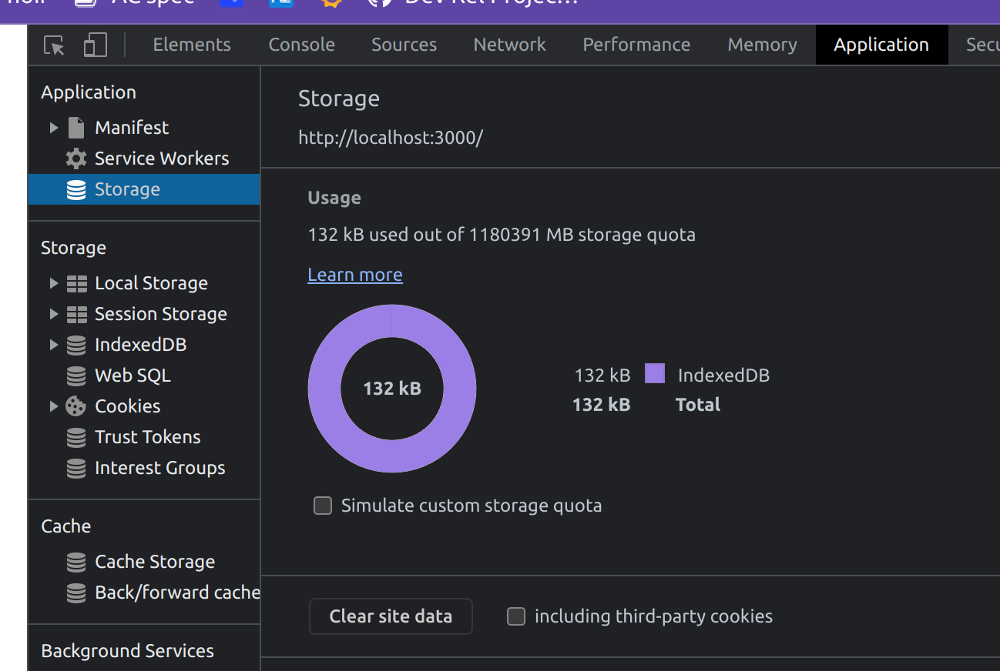

# Aztec Frontend Boilerplate

This is a sample Aztec frontend powered by [Aztec SDK](https://github.com/AztecProtocol/aztec-connect/tree/master/sdk) and [Create React App](https://github.com/facebook/create-react-app).

You can try it out on: https://aztec-frontend-boilerplate.netlify.app/

## Functions

A user with Metamask may interact with the Aztec Network using the project. Its functions cover:

### Account Management

- Connect to Metamask
- Register / Login an Aztec account

### Aztec Interactions

- Deposit ETH onto Aztec
- Swap ETH to wstETH through Aztec
- Log balances on Aztec

### Development with the Aztec SDK

- Initialize the Aztec SDK
- Log the Aztec SDK
- Log known bridges on the Aztec Testnet

See [App.tsx](src/App.tsx) for more details.

## Getting Started

## Prerequisites

- Install [Node.js](https://nodejs.org/en/download/)
- Install [Yarn](https://classic.yarnpkg.com/lang/en/docs/install/)
- Install [docker](https://docs.docker.com/get-docker/)

## Commands

### `yarn`

Install dependencies.

### `yarn start`

Runs the app in development mode.

Open [http://localhost:3000](http://localhost:3000) to view it in the browser. When you make changes, the page will automatically reload.

### `yarn build`

Builds the app for production to the `build` folder.

It bundles React in production mode and optimizes the build for the best performance. The build is minified and the filenames include the hashes.

See the [deployment](https://facebook.github.io/create-react-app/docs/deployment) section of the Create React App documentation for more details.

### `yarn devnet`

Starts a local ethereum network, deploys the aztec contracts and runs a local aztec sequencer.

If you run into this error:

```
Rollup not found for merkle root: 232e56c264cf93ac066440084035de11fa28faf0e2e76bc806c501d988a1b055
```

try clearing your site data in the Application tab of developer tools.



## Learn More

To learn more about the Aztec SDK, visit the [Aztec Docs](https://docs.aztec.network/category/sdk).

To learn more about React, visit the [React documentation](https://reactjs.org/).
